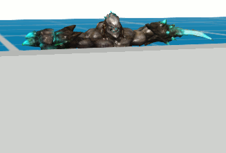

*Данный урок является продолжением урока [Материалы](https://github.com/urho3d-learn/materials). Если вы с ним ещё не ознакомились, то начните с него.*

---

# Постэффекты (WIP)

Продолжаем разбираться в графической подсистеме Urho3D. На этот раз поговорим об эффектах постобработки. В комплект движка входит множество
уже готовых эффектов, и один из них (Bloom) мы даже использовали в [прошлом уроке](https://github.com/urho3d-learn/materials).
Но ни один движок не способен удовлетворить все нужды любого разработчика, поэтому будет полезно научиться создавать свои
собственные эффекты. В качестве примера я решил выбрать эффект просвечивания персонажа через стены,
который нередко используется в стратегиях и РПГ.

## Идея

Простыми словами, постэффект представляет собой прямоугольный полигон, закрывающий весь экран. И наша задача - раскрасить этот полигон.

<b>Примечание</b>

Сразу оговорюсь, что я не ставил перед собой цель реализовать эффект самым оптимальным методом.
В первую очередь я хотел показать, как сделать это с помощью постпроцессинга максимально простым и понятным способом.

Итак, нам нужно:
1) Отрендерить сцену
2) Получить маску невидимой части персонажа
3) Окрасить маску в какой-нибудь цвет и наложить ее на рендер сцены

Чтобы получить маску невидимой части можно:
1) Повторно отрендерить персонажа с включенным тестом глубины, используя простой шейдер, выводящий белый пиксель
   (получаем таким образом чёрно-белую текстуру видимой части персонажа)
2) Повторно отрендерить персонажа, используя тот же шейдер, но уже игнорируя буфер глубины (получаем таким образом чёрно-белую маску всего персонажа)
3) Если в каком-то месте <ins>полная маска</ins> белая, а <ins>маска видимой части</ins> чёрная, то это и есть искомая невидимая часть персонажа

Итого нам нужно получить и скомбинировать три текстуры:

## Реализация

Батники для скачивания и компиляции рассматриваемой версии движка находятся в папке [engine](engine).

Готовая демка находится в папке [demo](demo).

## Загрузка рендерпасов

В [прошлом уроке](https://github.com/urho3d-learn/materials) мы рассматривали рендерпасы как способ задания очередности проходов в материалах (раздел `Процесс рендеринга`). Но рендерпасы выполняют также и [другие функции](https://urho3d-doxygen.github.io/doxygen/_render_paths.html).

Стандартные рендерпасы находятся в папке `CoreData/RenderPaths`. По умолчанию используется `Forward.xml`. Сменить рендерпас можно разными способами:

* Вызвать функцию `Renderer::SetDefaultRenderPath()` **перед** созданием вьюпорта. При этом последующие создаваемые вьюпорты будут использовать указанный рендерпас. Данный метод и [используется](demo/MyData/Scripts/Main.as) в демке.
* Указать рендерпас в параметрах движка (с помощью [параметров командной строки](https://urho3d-doxygen.github.io/doxygen/_running.html) при запуске приложения или через `engineParameters_` в тексте программы). При этом вызывается всё та же функция `Renderer::SetDefaultRenderPath()`.
* Использовать функцию `Viewport::SetRenderPath()` **после** создания вьюпорта.
* В редакторе рендерпас можно указать в окне `View` > `Editor Settings`.

---

*Старая версия демки: <https://github.com/1vanK/Urho3DHabrahabr06>.*

